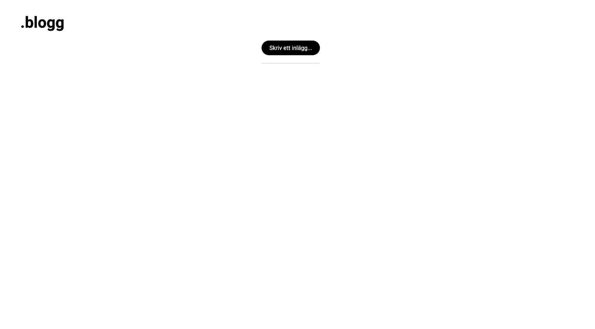
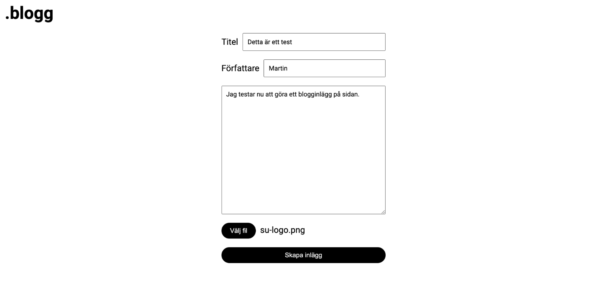
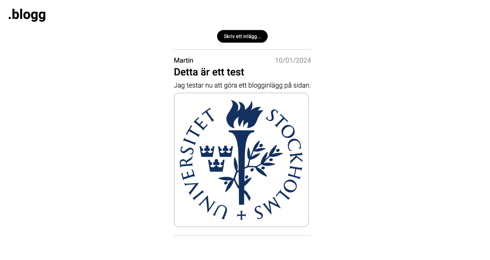
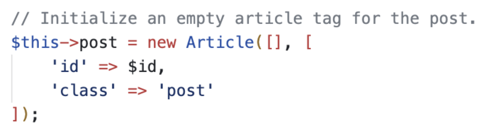
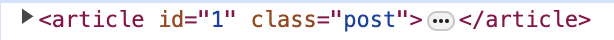

# .blogg

För min gesäll uppgift har jag byggt en enkel blogg. Bloggen bygger på ett enkelt api som hämtar blogginlägg från databasen och lägger in dem i en statisk HTML template innan de skickas från servern till klienten.

## Beskrivning

### Inlägg

Vid en GET-request startar servern från “index.php” som skapar en ny instans av Blog.php (api:et), den läser därefter in HTML från `./template.html` som skelett för sidan. Template.html har en markör `<!--$content–>` där innehållet placeras in. För startsidan läses HTML koden från `./view/feed.html` in som även där har en markör för inlägg, `<!--$posts–>`. Efter detta hämtas alla inlägg från databasen genom metoden `getPosts()` som returnerar en array med samtliga inlägg. Inläggen loopas igenom och läggs till istället för markören “$posts” och strängen läggs till istället för markören “$content”. Den genererade HTML koden skickas sedan till klienten.

När användaren klickar på knappen för “Skriv ett inlägg…” går den till “new-post.php”. Den läser in samma skelett som `index.php` men byter ut markören `$content` mot ett enkelt formulär.

När användaren fyllt i formuläret skickas den tillbaks till “index.php” med en POST-request. Globala variablerna `$_POST` och `$\_FILES` undersöks för data och “städas”. Är obligatoriska värden satta kallas metoden `createPost()` från api:et. Om en fil har bifogats flyttas den över till mappen `media/` med det temporära filnamnet. Webbläsaren laddar sedan om sidan så att även det nya inlägget laddas in.

### API

`Blog.php` klassen är wrapper för api:et. Klassen kommunicerar med databasen genom “Connection.php” som har metoder för `SELECT` och `INSERT` queries och använder sig av det inbyggda mysqli biblioteket. `User.php` är en klass för lagring av användarnamn och lösenord och `Database.php` för lagring av host och databas som `Connection.php` använder sig av. I toppen av wrappern definieras konstanter för användarnamn, lösenord, host och databas som ska användas av API:et. Klasserna för databasen ligger i `api/db/`. Databasen använder tabellen posts med kolumnerna: `id` (int), `date` (date), `title` (varchar), `content` (varchar) och `media` (varchar).

För att översätta databasen till ett inlägg så används modellen `Post.php`. Klassens konstruktor tar samma argument som tabeller i databasen. Klassen används för att översätta data i databasen till HTML kod. För att uppnå detta används olika komponenter som representerar HTML taggar. Dessa återfinns i `api/components/`.

Komponenterna består av tre abstrakta föräldraklasser, `Tag.php`, `Element.php` samt `VoidElement.php` och ett antal barnklasser där barnen representerar olika HTML taggar. Samtliga klasser ärver metoden `render()` som översätter data som klassen har till HTML syntax som en sträng. `Tag.php` lagrar endast informationen mellan “<” och “>” dvs namnet på taggen och eventuella attribut i en array. “Element.php” samt “VoidElement.php” representerar ett HTML-element såsom `
` respektive självstängande HTML-element såsom ``. Ett element kan ha innehåll mellan taggarna som lagras i en array kallad content. Metoden `render()` skapar en sträng som har elementets tag, eventuella attribut, eventuellt innehåll och stängningstag. Samma gäller för metoden `render()` i självstängande element men då endast med tag och eventuella attribut. Samtliga klasser för HTML taggar ärver från någon av dessa två klasser och deras konstruktorer initierar med rätt tag och det innehåll och attribut som skickas med till klassen. Detta gör att `Post.php` kan konstruera ett inlägg med rätt taggar genom att endast kalla på klasserna med rätt data.

`Post.php` skriver även över `__toString()` metoden genom att kalla på `Article.php` (den övre föräldern i ett inlägg) render metod. När inläggen loopas igenom kan de helt enkelt direkt översättas till strängar och därav korrekt HTML syntax.

## Sammanfattning

Mitt mål med denna uppgift var att använda klasskomponenter för att hantera HTML, efterlikna MVC-modellen och simulera ett enkelt API. Jag försökte bygga som om det vore ett REST API och hade lika gärna kunnat hantera innehållet genom javascript på front-end som skickade fetch-requests till php och kommunicerade genom JSON. Jag valde att göra det på serversidan för jag ville öva på att generera statiska sidor och använda så lite kod på klientsidan som möjligt. Genom att bygga grundläggande byggstenar genom Tag och Element/VoidElement kunde jag sedan skapa en ny HTML block så fort jag behövde det genom att skriva en konstruktor. Det gjorde att jag enkelt kunde utöka programmet. Till att börja med kunde jag endast ladda upp bilder men det krävdes ytterst få ändringar för att även stödja videofiler.

Jag hade även en tanke av att redigera inlägg. Eftersom att data ligger i taggar och har id från databasen krävs det inte mycket för att hämta datan från ett specifikt id när en knapp klickas på. En `<button>` som ligger i `
` för varje inlägg skulle kunna kalla på en metod som hämtar inlägget, laddar formuläret och fyller värdena från databasen. Det får bli en utökning till framtiden men kunde inte genomföras på grund av tidsbrist denna gång.

Jag har försökt att strukturera filerna på ett rimligt sätt och även försökt hålla de väldokumenterade. Jag har följt liknande stil på dokumentation som JavaDoc. Jag är nöjd med min gesäll och tyckte det var en rolig utmaning!
